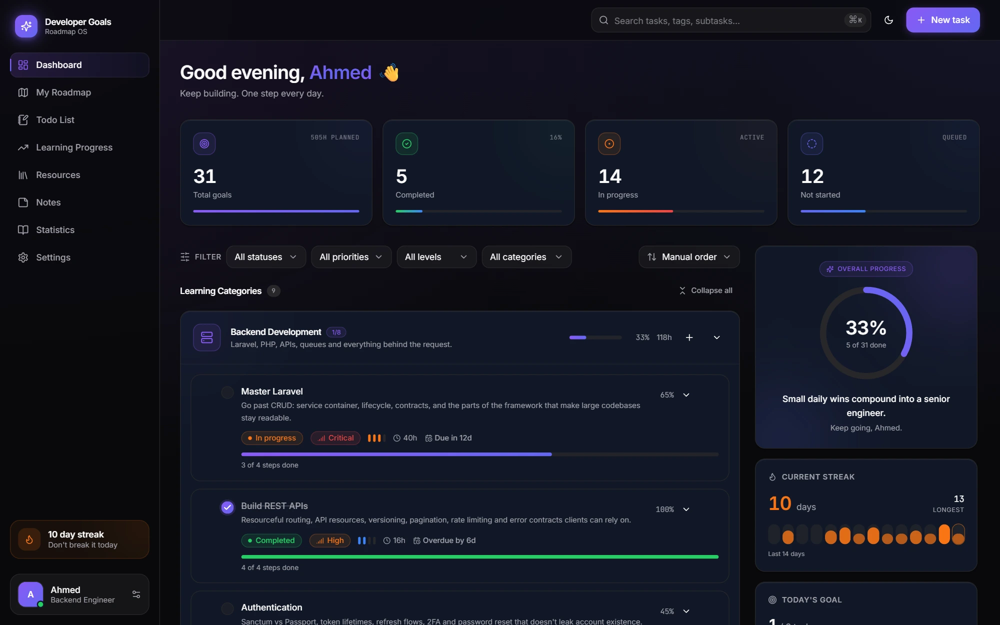
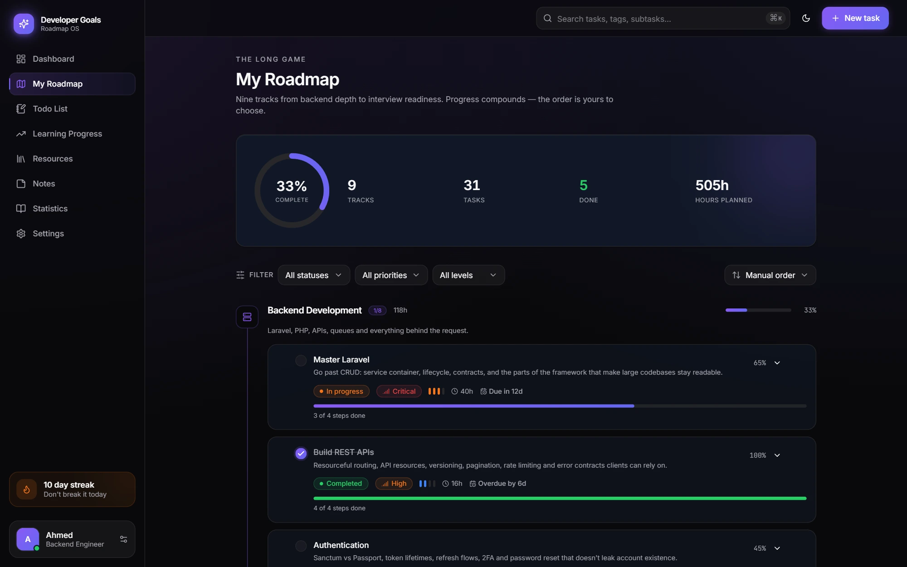
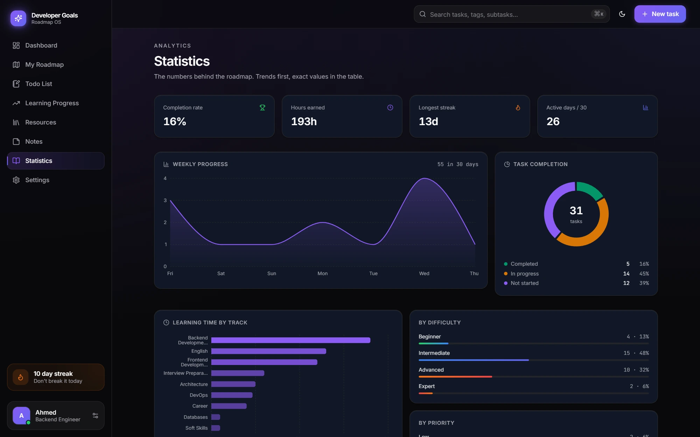
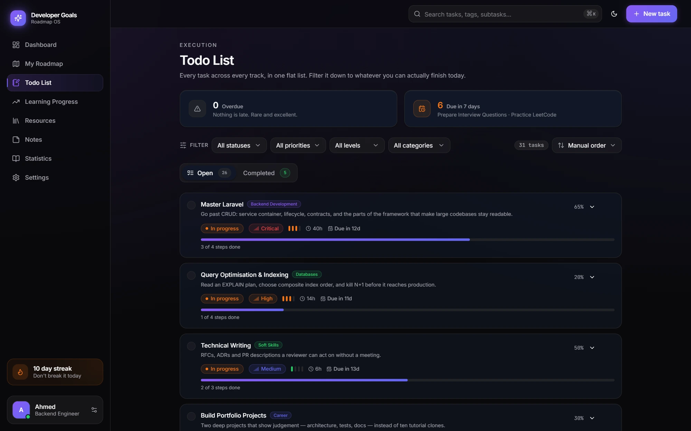
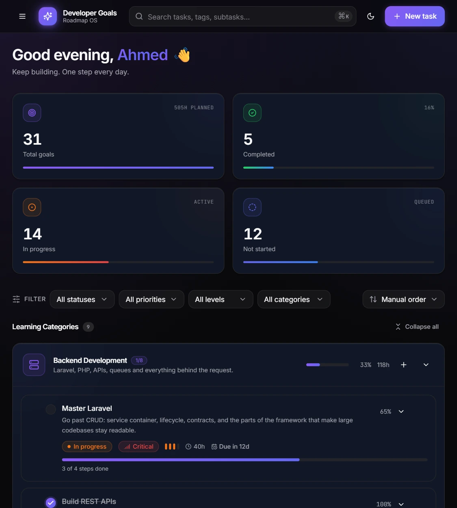

<div align="center">

# Developer Goals — Roadmap OS

**A premium, dark-first roadmap dashboard for developers.**
Track learning goals across nine tracks, build a streak, and see where the hours actually went.

### 🔗 [Live Demo](https://dev-track-ahmed.vercel.app/)


</div>



---

## Features

- **Nine learning tracks** — backend, frontend, DevOps, databases, architecture, soft skills, career, English, interview prep
- **Rich tasks** — difficulty, priority, estimated hours, deadlines, checklists, tags, resource links, expandable details
- **Drag & drop reordering** — mouse *and* keyboard (Space, then arrows)
- **Search, filter, sort** — by status, priority, difficulty, track; `⌘K` to focus search
- **Streaks & daily goals** — a 14-day activity strip, current vs. longest streak, a target that resets each morning
- **Charts that earn their space** — weekly activity, hours per track, completion donut, overall progress ring
- **Confetti on completion** — fired from the checkbox you actually clicked
- **Animated counters, progress rings, card lifts, ripples** — Framer Motion throughout
- **Fully responsive** — three-column desktop, stacked tablet, single-column mobile
- **Zero backend** — no account, no server, no telemetry; state lives in `localStorage`

## Quick start

```bash
npm install
npm run dev      # http://localhost:3000
```

Runs immediately — no env vars, no database, no setup. `npm run build` and
`npm run typecheck` work the same way.

## Screenshots

| Roadmap | Statistics |
|---|---|
|  |  |

| Todo List | Tablet |
|---|---|
|  |  |

## Stack

Next.js 15 (App Router) · TypeScript (strict) · Tailwind CSS · shadcn/ui (Radix)
· Framer Motion · Recharts 3 · Zustand · dnd-kit · Lucide.

## Project structure

```
app/            routes — thin server components that compose client islands
components/
  ui/           shadcn/ui primitives (Radix + cva). No app logic.
  common/       cross-cutting building blocks (counter, ring, ripple, empty state)
  layout/       the app frame: sidebar, topbar, theme, profile
  tasks/        task row, list + DnD, filters, search, create dialog
  categories/   the nine learning tracks
  charts/       Recharts wrappers on the validated palette
  panel/        the right stats rail
  views/        one client component per route
hooks/          hydration guard, media queries, confetti, the read-model
lib/            tokens, seed data, pure derivations, motion vocabulary
store/          Zustand stores (persisted)
types/          the domain model everything else derives from
```

### Why the layers are split this way

**`types/` is the root.** `Task`, `Category`, `TaskStatus` and friends are
defined once; every other layer imports from here. Change the model and the
compiler shows you every site that cares.

**`store/` holds only facts, never derived numbers.** Two stores, split by
lifetime: `use-roadmap-store` is the user's data (tasks, activity, notes,
profile, theme), `use-ui-store` is view state (filters, sort, collapsed
categories). They persist separately because they mean different things — losing
your filters is fine, losing your roadmap is not. There is no cached
`completedCount` anywhere; a counter that can disagree with the list it counts
eventually will.

**`lib/stats.ts` is pure functions.** Every number on screen — completion rate,
streak, category progress, chart series — is computed here from `tasks` and
`activity`. Pure, so it's trivially testable and has exactly one definition of
each metric.

**`hooks/use-roadmap.ts` is the read-model.** It composes store + stats behind
one memoised hook. Pages ask for what they need rather than re-deriving it, so
"completion rate" is calculated once per change, not once per component.

**`components/ui/` knows nothing about roadmaps.** Primitives take props and
render. Everything above them is free to change without touching a button.

**`components/views/` is one component per route.** Routes stay server
components with metadata; the interactive body is a single client island.

### Notable decisions

- **Charts don't use the brand colours.** Violet `#8B5CF6` and indigo `#6366F1`
  are one gradient as chrome and a bug as data — they score ΔE 6.3 for normal
  vision and **0.8** under protanopia, meaning two series a full-colour reader
  can't separate and a colourblind reader sees as identical.
  `lib/chart-palette.ts` carries a separate six-hue palette, validated as a set
  against the `#111827` card surface (lightness band, chroma floor, CVD
  separation, contrast). The reasoning and the scores are documented in that file.
- **Colour is never the only encoding.** The donut ships a legend *and*
  per-slice labels; the bar charts carry names on the axis; `/statistics` has a
  full table view.
- **Drag & drop only where it means something.** Reordering is enabled when a
  list is scoped to one category *and* sorted manually — dropping into position
  #2 of a deadline-sorted list would be a lie the next render undoes.
  Keyboard reordering works (Space, then arrows).
- **Hydration is explicit.** `localStorage` is *synchronous*, so zustand
  rehydrates during module evaluation — before React renders. Seeding a flag
  from `persist.hasHydrated()` therefore returns `true` on the client's first
  render and `false` on the server, and React throws a hydration mismatch.
  `useHydrated()` starts `false` on every path and only opens in an effect, so
  the first client render is byte-identical to the server's; data surfaces show
  a skeleton until it flips. (`persist` is also read through an optional chain —
  the API genuinely doesn't exist during SSR, where there's no storage engine.)
- **Reduced motion is honoured twice.** `MotionConfig reducedMotion="user"`
  covers Framer; `usePrefersReducedMotion` covers confetti and ripples, which
  Framer can't see.
- **Light theme is wired, not shipped.** Tokens exist for both modes and the
  toggle writes to the store. Turning it on is a product call — the chart
  palette has only been validated against the dark surface.

## Accessibility

Skip link · focus-visible rings preserved everywhere · Radix primitives for
every overlay (focus trap, Escape, scroll lock) · `aria-expanded`/`aria-controls`
on all disclosures · keyboard-operable drag & drop · animated counters expose the
final value to screen readers rather than every frame · charts have a table
fallback · `prefers-reduced-motion` respected globally.

## Data

The app ships with seeded sample data — 31 tasks, 4 notes, and 90 days of
activity — so the charts, streak and progress ring have something real to show
on first load. Dates are stored as offsets and resolve against *today*, so the
roadmap always looks live. After first load your own state persists to
`localStorage` under one versioned key; **Settings → Data → Reset** restores the
sample set.

Because persistence is per-browser, everyone who opens the demo gets their own
copy starting from the seed — this is a personal tool, not a multi-user product.
